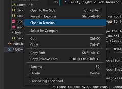
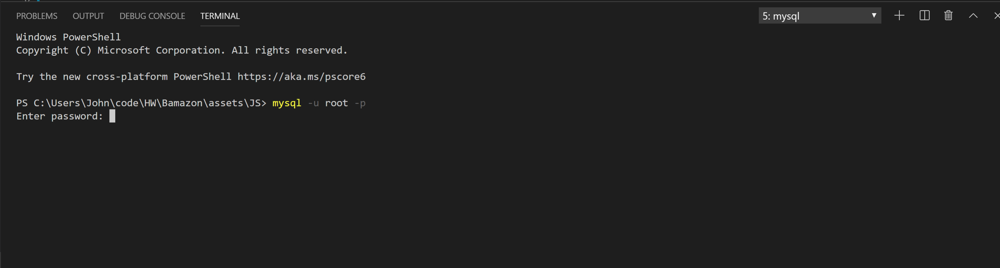
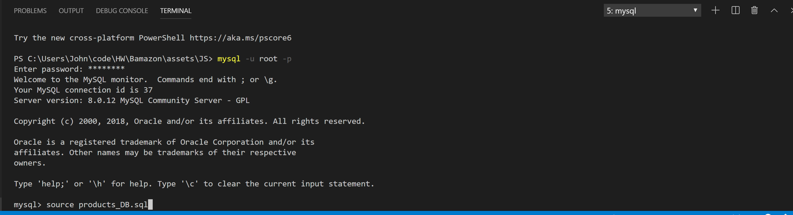
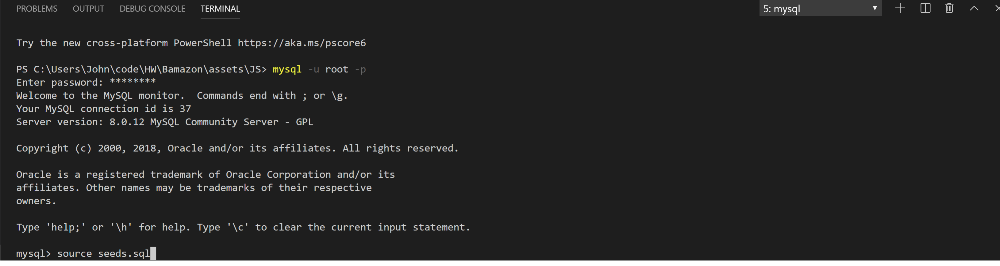
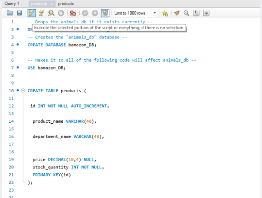
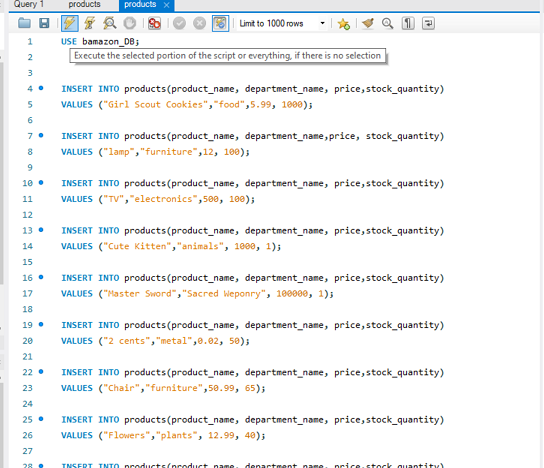
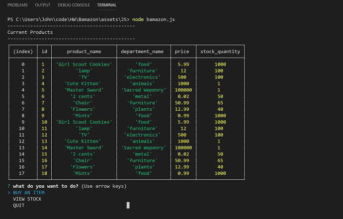
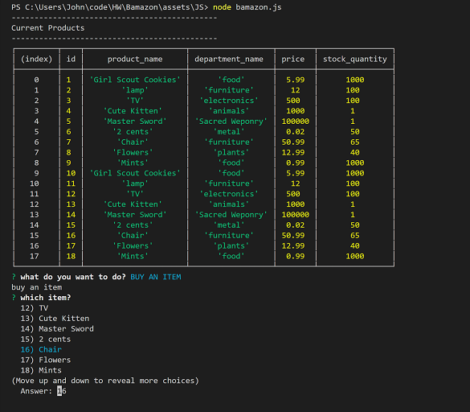
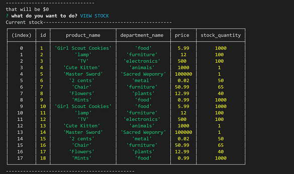

## APPLICATION SUMMARY- BAMAZON
 
In this application, you'll be interacting with an Amazon-like storefront through the terminal. This app will take in orders from you, the user and deplete stock from the store's inventory. 
 
# APPLICATION INSTALLATION REQUIREMENTS------------------------
 
To get this application running properly on your machine a few steps must be taken.
 
### **--Step one** **Download Packages:**
 
After cloning the repository, you must first install all of the required packages. 
This is done by opening up your terminal and running the command
 
-npm install
 
 
Congratulations! You have finished step One!
 
### **--Step Two** **Loading MYSQL:**
 
After completing step one you will need to initialize the schema/seeds file within the BAMAZON folder.
 
This can be done through a variety of methods, I will be using the terminal method*.
 
* First, right click bamazon.js and click open in terminal.
 

 
* Then, type in mysql -u root -p
  * this will prompt you to enter a password, for this database it is just, "password" no quotes.
 
  
 
* Once completed, type the following two commands
    * source products_DB.sql (loads the schema)
 
    
 
    * source seeds.sql (loads in the items)
 
    
    
 
* Once completed you are good to go!
 
* (*If you don't feel comfortable using this method, you can also copy paste products_DB.sql/seeds.sql 's contents into A MYSQL workbench. Then hit the lightning bolt icon. This will have the same effect)
 
 
    
 
 
    
 
    
 
# APPLICATION USE------------------------
 
 Once the Above Tasks are completed application use is simple. 
 
  * **First**, right click once again on bamazon.js 
    * then type in the command node bamazon.js
 
  * Then you will be prompted to proceed with two actions.
 
        
 
    * BUY AN ITEM:
        * Simply follow the commands, cycle through the items until one catches your eye.
 
        
 
        * Then select How many you would like to buy.
            * If the value you specified is too high, you will be told it is not possible at this time, and brought back to the start menu.
            * If it is within the quantity allotted, you will be told how much you just spent 
    * VIEW STOCK:
        * Displays a table of the current values within your products database. 
 
 
        
    
    * QUIT: 
        * Ends your session. If you chose this, you must follow the First bullet point to re-enter the app.
    
 
 
        
 
 
 
 
 
 
 
 
 

